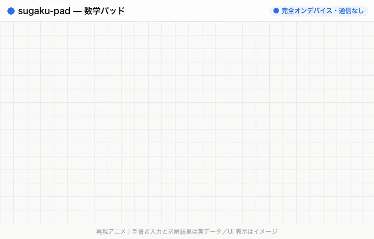
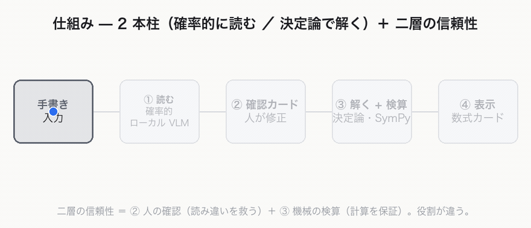
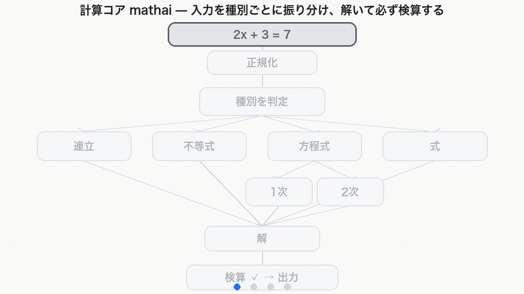

# sugaku-pad — 完全オンデバイスの手書き数学ノート

  

⚠️ 上の動画は<b>再現アニメ</b>です（手書き入力と求解結果は実データ／UI 表示はイメージ）。実機録画は別途差し替え予定。

> iPad に手書きした数式を、**クラウドに一切送らず端末の中だけで**「読んで・解いて・検算する」ノートアプリ。
> **読む**＝ローカル Vision LLM（MLX / Qwen2-VL 2B）、**解く**＝端末内の Python + SymPy。**通信ゼロ・データは端末の外に出ない。**

個人の**研究・学習プロジェクト**。テーマは **「ローカル限定の LLM で、手書き数学はどこまでいけるか — 完全オンデバイスで」**。

---

## なぜ作ったか — 既存サービスとの違いと、その裏付け

手書き数学アプリ自体は珍しくない。差別化は機能ではなく **「どこで動かすか」** にある——**クラウドに依存せず、iPad 単体・ローカル LLM だけで完結**させた点。

| | クラウド型の既存サービス | **sugaku-pad** |
|---|---|---|
| 認識（読む） | サーバへ送信 | **端末内のローカル VLM（MLX Qwen2-VL 2B）** |
| 求解（解く） | サーバ / API | **端末内の CPython + SymPy** |
| 通信 | ネット必須 | **通信ゼロ・機内モードでも動く** |
| データ | 外部サーバへ送信 | **端末の外に一切出ない（完全プライベート）** |
| コスト | API / サブスク | **API 課金ゼロ** |
| 答えの正しさ | ブラックボックス | **SymPy が解を代入して決定論的に検算（verified）** |

### で、本当にオンデバイスで動くのか（研究ログ・自分の設計判断）

「完全オンデバイス」を成立させるために、思いつきではなく**自分で検証して決めた**こと。

- **オンデバイスでモデルを選定（証拠ベース）** — 実機 MLX ベンチで Qwen2-VL **2B / 3B / 7B** を比較。意外にも **3B-4bit は実機で誤読が多く、2B-4bit の方が安定**（精度・RAM ~1.5GB・冷えロードの速さ）。8GB iPad では **2B を採用**（7B は 16GB 機向け）。印刷数式 OCR（pix2tex）は手書きで破綻することも実測。→ [`OCR_BENCHMARK.md`](docs/superpowers/spikes/OCR_BENCHMARK.md)
- **求解は Python 埋め込みで（Swift 再実装ではなく）** — 記号計算は SymPy が圧倒的に堅い。書き直すより **CPython を端末に埋め込み `mathai`/SymPy をそのまま動かす**判断。→ [`ONDEVICE_PYTHON.md`](docs/superpowers/spikes/ONDEVICE_PYTHON.md)
- **信頼性を定量化** — OCR 誤りを安全網がどれだけ止めるか測定。**検算が止めたのは 6%、残り 94% は「確認カード（人の目）」頼み**だった（誤読された式も“その式としては正しく解ける”ため検算を通る）。→ 二層が**別目的で**必要だと数値で確定。※ 16 問・単一文字の模擬誤り 141 件という**小規模ベンチ**で、実 OCR 誤り分布での再測は今後。→ [`RELIABILITY.md`](docs/superpowers/spikes/RELIABILITY.md)
- **つまずき & デバッグ（実機が教えた罠）** — ①ダークモードで PencilKit の黒インクが白画像化し OCR が破綻 → ライトトレイトで描画して解決。②正方形 1024 リサイズで横長の式が潰れ精度劣化 → アスペクト比保持に。③OCR が桁の間に空白を入れる → 桁間だけ詰める。
- **端末内 AI フレームワークの調査** — Apple Core AI を調べ、現状要件では手書き OCR に不適と判断 → **MLX Swift** を採用。→ [`COREAI_SPIKE.md`](docs/superpowers/spikes/COREAI_SPIKE.md)

> より詳しい技術解説は **アプリ内技術書**（[`docs/techbook.html`](docs/techbook.html)）。低レベル（MLX とは）から Python 埋め込みの決断、設計判断ログまで。

---

## 仕組み — 2 本柱 ＋ 二層の信頼性

  

- **2 本柱** … **読む（確率的・ローカル VLM）** と **解く（決定論・SymPy）** という、性質の違う 2 つを組み合わせる。
- **二層の信頼性** … ② **確認カード（人）** ＝ 読み違い（OCR）を救う ＋ ③ **検算（機械）** ＝ 計算の正しさを保証。**役割が違うから両方要る**（上の研究ログの 6% / 94% がその根拠）。

---

## 計算コア `mathai` の中身

  

`=` の有無で方程式 / 式に分け、**種別（連立・不等式・方程式→1次/2次・式）ごとに SymPy で解き、最後に必ず解を代入して検算**する（`verified`）。手前の **LaTeX 入力層**が OCR の癖（暗黙の掛け算 `2x→2*x`、`\frac`/`\sqrt`、桁間スペース、デリミタ 等）を吸収する。

---

## 技術スタック

- **UI**: SwiftUI / PencilKit（手書き）/ SwiftMath（数式描画）
- **読む**: MLX Swift（mlx-swift-examples）＋ Qwen2-VL 2B 4bit
- **解く**: 端末内 CPython（Python-Apple-support 3.13）＋ SymPy（`mathai/`）

## 構成

| ディレクトリ | 役割 |
|---|---|
| `ios/` | **ネイティブ iPad アプリ**（SwiftUI + PencilKit）。端末内 MLX 推論 ＋ 埋め込み Python |
| `mathai/` | **計算コア**（LaTeX 入力層 + SymPy SolveEngine）。テスト付き |
| `spikes/` | OCR・計算エンジンの検証スクリプト（モデル比較／信頼性注入 等） |
| `docs/` | 設計・実装計画・検証結果・技術書 |
| `web/` ・ `webapp/` | 前身の Web 版（FastAPI + Canvas）。ネイティブ版の足場 |
| `assets/demo/` | README 用のデモ・図アニメと生成スクリプト |

## ステータス

- ✅ **iPad 実機（M4）で** 手書き → オンデバイス OCR（MLX Qwen2-VL 2B）→ 確認 → 端末内 SymPy 求解 → 検算 が動作確認済み
- ✅ 計算コア `mathai` テスト PASS（一次/二次/不等式/連立・検算付き）
- 🔬 ローカル LLM のオンデバイス実機ベンチ・信頼性の定量化を実施（`docs/`）

## 正直な限界

- オンデバイス VLM の認識は完璧ではない（だから確認カードで人が直す設計）。
- 信頼性ベンチは小規模（16 問・模擬誤り）。実 OCR 誤り分布での再測は今後。
- README 冒頭のデモは**再現アニメ**で代用中（実機録画への差し替え予定）。
