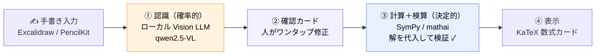
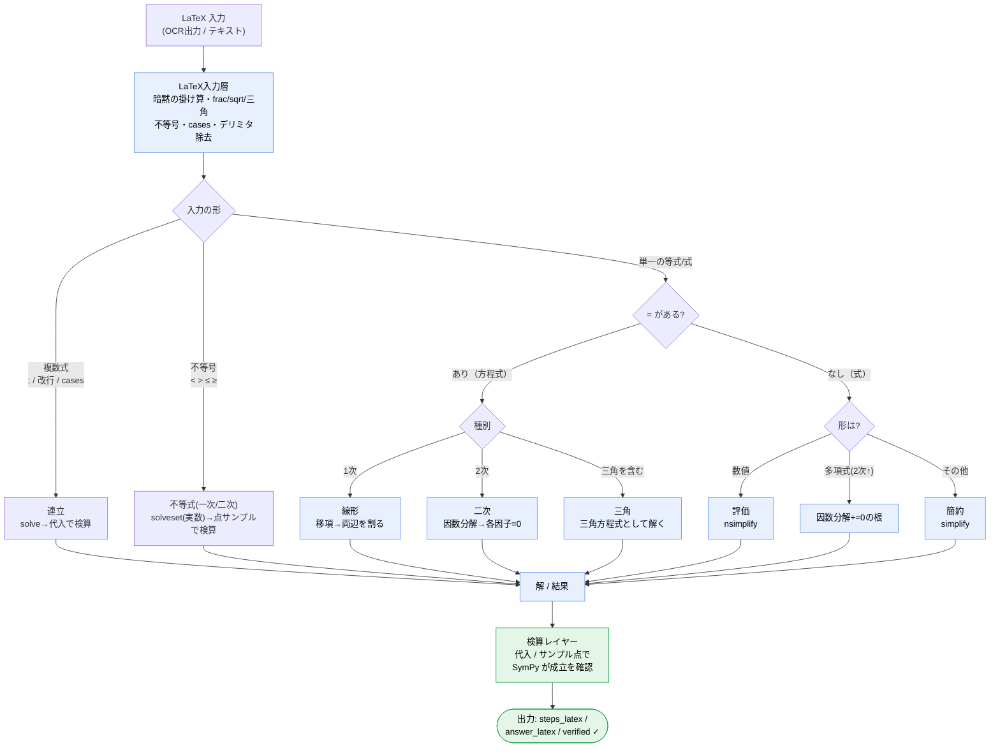

# sugaku-pad — 手書き数式を解くノートアプリ（ローカル LLM 研究）

iPad に手書きした数式を認識して解く、**オンデバイス志向**の数学ノートアプリ。
クラウドサービス（Goodnotes 等）の完成度を目指すのではなく、
**「ローカル LLM だけで、どこまで滑らかなユーザー体験を作れるか」** を検証する個人研究プロジェクト。

## デモ

> 近日掲載：実際に iPad で手書きして解いている様子の録画を載せます。

（現状の一例：手書き `2x + 7 = 9` → 認識 `2x+7=29` → **x = -5**、手書き `2/(x²-4) - 1/(x²+2x)` → **1/(x(x-2))** に簡約）

---

## 取り組んでいること（3 本柱）

### 1. OCR — ローカル LLM による手書き数式認識と精度検証

手書き数式 → LaTeX を、**ローカルのビジョン LLM** で行う。研究として実手書きで比較・計測した：

- 印刷数式用 OCR（pix2tex）は**手書きで破綻**することを実測で確認（出力が文字化け）。
- ビジョン LLM を実手書きで横並び比較し、最良を選定：

  | モデル | 実手書きの認識 | 速度(ウォーム) | 実行場所 |
  |---|---|---|---|
  | **qwen2.5-VL 7B** | 正確 ✅（採用） | 約 0.5s | ローカル(Mac/Ollama) |
  | qwen3-VL | 正確 | 約 2.5s | ローカル |
  | gemma 12B | 正確だが遅い | 9〜35s | ローカル |

- 認識は完璧ではない前提に立ち、**確認カード（認識結果を編集して確定してから解く）**で体験を滑らかにする設計。

### 2. 計算コア — 自前設計の SymPy ソルバ（`mathai/`）

OCR が出す “癖のある” LaTeX を、決定的に解ける計算エンジンへ自分で設計した。

- **LaTeX 入力層** … 暗黙の掛け算（`2x`→`2*x`）、`\frac` / `\sqrt` / `^{}` / 三角関数、数式デリミタ（`\( \)` 等）除去、**解く変数の自動判定**（`x` でも `θ` でも解ける）。
- **SolveEngine** … 一次・二次方程式（因数分解の手順付き）/ 連立方程式 / 不等式（一次・二次）/ 三角方程式 / 式の簡約 を**分類**し、**教育的なステップ**で提示。
- **テスト駆動**（25 ケース）。実データで出た認識の癖は回帰テスト化して堅牢化（例：`\(...\)` 付きの式が解けないバグを再現テスト→修正）。

### 3. オンデバイス化 — Apple Core AI の検証（クラウド / Ollama の代替）🔬

最終目標は **iPad 内で完結**（クラウドにも Mac にも依存しない）。最近発表の **[Apple Core AI](https://developer.apple.com/core-ai/)**（CoreML 後継の端末内 AI フレームワーク）を調査した（[詳細](docs/superpowers/spikes/COREAI_SPIKE.md)）。

- **調査結果**: Core AI は (a) **macOS/iOS/Xcode 27.0+ 必須**（本機は 26.5）、(b) モデルカタログに**手書き OCR 用の VLM が未提供**（テキスト LLM・CLIP・YOLO・SAM 等が中心）と判明。→ 端末内 OCR への即適用は不可。
- **判断**: 流行に飛びつかず、**OCR は当面ローカル Ollama（qwen2.5-VL）を維持**（手書きに強いと実測済み）。Core AI は 27 系 GA 後に再評価し、**まずは「解説 LLM の端末内化（テキスト）」**用途を想定。
- 既存の検証: pix2tex エンコーダの Core ML 変換は成功（`torch.export` 経由）も、デコーダ＋手書き精度の壁で OCR 採用は見送り。

---

## アーキテクチャ（バックエンドの仕組み）

設計の肝は **「確率的なローカル LLM 認識」と「決定的な SymPy 計算」を、人の確認カードと検算で橋渡しする二層構造**。

横一列の 4 ステップ。肝は **①確率的なローカル LLM 認識 → ②人の確認 → ③決定的な SymPy 計算＋検算** という流れ：
- **① 認識（オレンジ）**: ローカル Vision LLM が手書き→LaTeX（完璧でない前提）
- **② 確認（紫）**: 誤認識をワンタップ修正＝“最後の数%”の保険
- **③ 計算＋検算（青）**: SymPy で求解し、**答えを元の式に代入して検証**（`verified`）。間違いは弾ける

### 計算コア（`mathai`）の中身

決定的な計算層の内部。`=` の有無で方程式/式に分け、種別ごとに SymPy で解いて**検算**する。

## 構成

| ディレクトリ | 役割 |
|---|---|
| `mathai/` | **計算コア**（LaTeX 入力層 + SymPy SolveEngine）。テスト付き |
| `webapp/` | Excalidraw を土台にした手書き UI（Web / iPad Safari） |
| `web/` | 認識 + 求解バックエンド（FastAPI） |
| `ios/` | ネイティブ iPad アプリ（SwiftUI + PencilKit）※ 端末内推論は Core AI を採用予定 |
| `spikes/` | OCR・計算エンジンの検証スクリプト（モデル比較／Core ML 変換 等） |
| `docs/` | 設計・実装計画・検証結果 |

## ステータス

- ✅ Web で **手書き → 認識 → 確認 → 求解** が end-to-end 動作
- ✅ 計算コア 25 テスト PASS
- ✅ ネイティブ iPad アプリ（SwiftUI/PencilKit）UI 実装・iOS シミュレータでビルド/起動確認済み
- 🔎 **Apple Core AI を調査済** → 27系要件＋OCR向け VLM 未提供のため OCR はローカル継続、Core AI は将来のテキスト LLM 端末内化候補と判断（[詳細](docs/superpowers/spikes/COREAI_SPIKE.md)）
